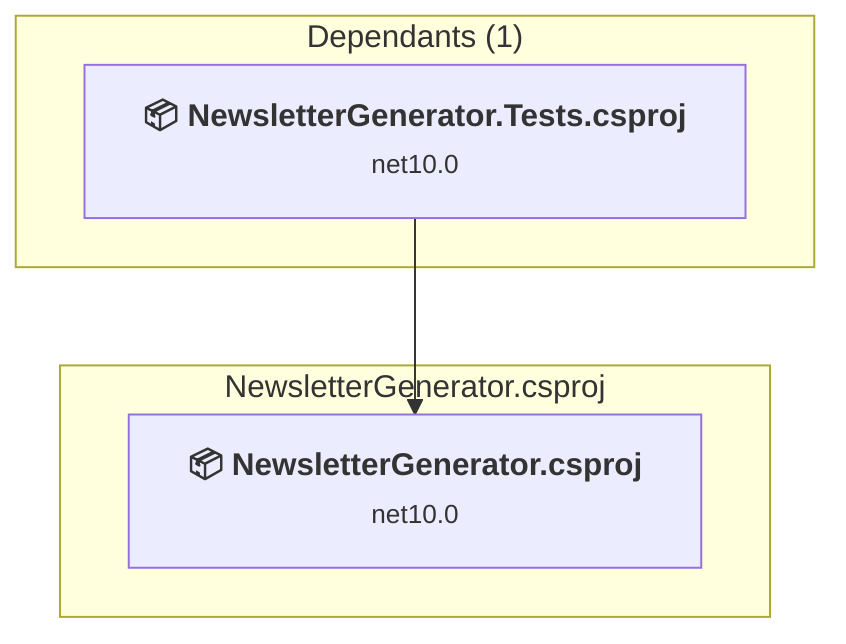

# src\NewsletterGenerator\NewsletterGenerator.csproj

[← Back to the assessment index](../../assessment.md)

## Project Info

- **Current Target Framework:** net10.0
- **Proposed Target Framework:** net11.0
- **SDK-style**: True
- **Project Kind:** DotNetCoreApp
- **Dependencies**: 0
- **Dependants**: 1
- **Number of Files**: 18
- **Number of Files with Incidents**: 7
- **Lines of Code**: 6797
- **Estimated LOC to modify**: 63+ (at least 0.9% of the project)

## Related Projects

**Depended on by (1)** — projects that reference this one:

- [D:\Users\Jon\Documents\GitHub\newsletter-generator\tests\NewsletterGenerator.Tests\NewsletterGenerator.Tests.csproj](../projects/NewsletterGenerator.Tests.md)

## Dependency Graph

Legend:
📦 SDK-style project
⚙️ Classic project

## API Compatibility

| Category | Count | Impact |
| :--- | :---: | :--- |
| 🔴 Binary Incompatible | 0 | High - Require code changes |
| 🟡 Source Incompatible | 47 | Medium - Needs re-compilation and potential conflicting API error fixing |
| 🔵 Behavioral change | 16 | Low - Behavioral changes that may require testing at runtime |
| ✅ Compatible | 11440 |  |
| ***Total APIs Analyzed*** | ***11503*** |  |

## NuGet Package Issues

| Package | Current Version | Suggested Version | Severity | Issue |
| :--- | :---: | :---: | :---: | :--- |
| Microsoft.Extensions.Logging | 10.0.10 | 10.0.12 | 🟡 Potential | NuGet package upgrade is recommended |
| Microsoft.Extensions.Logging.Abstractions | 10.0.10 | 10.0.12 | 🟡 Potential | NuGet package upgrade is recommended |

Every project affected by these packages, and the versions the repository settles on: [aggregate NuGet packages](../nuget/aggregate-packages.md).

## Project Technologies and Features

| Technology | Issues | Percentage | Migration Path |
| :--- | :---: | :---: | :--- |
| WCF Client APIs | 44 | 69.8% | WCF client-side APIs for building service clients that communicate with WCF services. These APIs are available as exact equivalents via NuGet packages - add System.ServiceModel.* NuGet packages (System.ServiceModel.Http, System.ServiceModel.Primitives, System.ServiceModel.NetTcp, etc.) |

